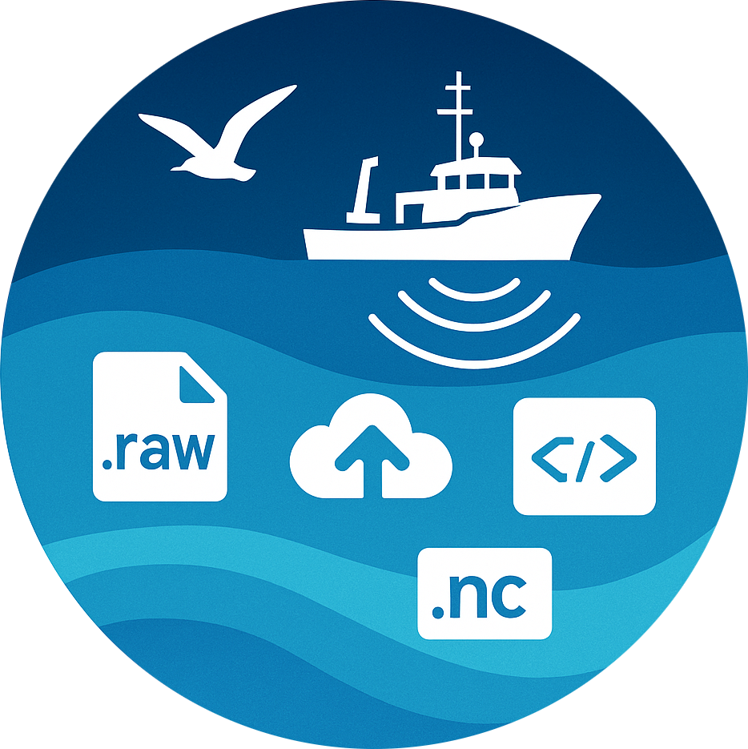

<!-- markdownlint-configure-file {
  "MD013": {
    "code_blocks": true,
    "tables": false
  },
  "MD033": false,
  "MD041": false,
  "MD013": false
} -->

<div align="center">
<div>
  
</div>
<hr />

<p align="center">
  
</p>

The Active Acoustics Strategic Initiative (AASI) aims to bring more data modernization to NOAA NMFS. This library is a data management tool that provides users with an all-in-one solution to load, transform, and analyze acoustics data from all science centers across the United States. Using the library, users now have the ability to:

<div align="left">

* Fetch data from disparate sources using a single source of retrieval, including being able to upload their personal data to the cloud.
* Cache repeatedly accessed data, optimizing data retrieval speeds.
* Transform and cache the transformed files, eliminating the need to constantly transform data before analysis.

</div>

Future plans include integration with more data sources, leading to petabytes of more data, and further integration with EchoPype. All together, the API provides users with a one-stop-shop for acoustics data. </br> </br>

[Getting Started](#getting-started) •
[Installation](#installation) •
[Dependencies](#dependencies) •
[Usage](#usage) •
[Recipes](#recipes)

</div>

This repo contains code necessary for execution of data pipelines for NOAA Active Acoustics.

# Getting Started

If this library has already been installed, you can run a quick test using `python quick_test.py`. This test will check if your network connections to the data sources are working, and download a small raw file as an initial test.

## Installation

To securely install this package via pip, use the following:

### Step 1 - Log Into `gcloud`

Issue the following command, and follow the instructions to login to `gcloud` using your NOAA email. This authentication is necessary if you want to use `aalibrary` with its Google Cloud Platform capabilities.

```bash
gcloud auth login
gcloud auth application-default login
```

### Step 1.1 - Set Your Account As The Active Account For `gcloud`

```bash
gcloud config set account {ACCOUNT} 
```

Here, `{ACCOUNT}` should be your noaa.gov email. The same one you used to sign-in in the step above.

### Step 1.2 - Set The AA GCP Project As The Active Project For `gcloud`

```bash
gcloud config set project ggn-nmfs-aa-dev-1 
```

### Step 2 - Install Necessary Dependencies Before The `pip install`

We need to install some dependencies, and check two authentication parameters before we install.

#### Step 2.1 - Run The Following Commands To Install Dependencies

```bash
sudo apt-get update && sudo apt-get install python3-virtualenv -y
python -m virtualenv my-venv
```

### Step 3 - It's Finally `pip install` Time

To finally be able to pip-install the library use the following command:

```bash
my-venv/bin/pip install aalibrary@git+https://github.com/nmfs-ost/AA-SI_aalibrary.git
```

**NOTE:** Since we have created a virtual environment, in order to use `aalibrary` simply replace all `python` commands with `my-venv/bin/python` and all `pip` commands with `my-venv/bin/pip`.

### Step 4 - Test it Out

Now that the library is installed, we can finally test it out. Open up a python  using the following command:

```bash
my-venv/bin/python
```

Next, we will enter the following code line-by-line. This will run a test function that will allow us to quickly test connectivity in our environment.

```python
from aalibrary import quick_test
quick_test.start()
```

## Dependencies

Dependencies are listed within the `requirements.txt` file within the Cloud Source Repo, however, they should be installed when you first install `aalibrary`.

## Usage

Here are some examples of functions that you can use in this library.

### Converting A Raw Into Netcdf

In order to convert a raw file into a netcdf, use the following example as a guide:

```python
from aalibrary import utils
from aalibrary.conversion import convert_raw_to_netcdf

# Create a GCP bucket object
gcp_stor_client, gcp_bucket_name, gcp_bucket = utils.cloud_utils.setup_gcp_storage_objs()

# This function takes care of downloading, converting, and uploading (caching) the netcdf file in gcp.
convert_raw_to_netcdf(file_name="2107RL_CW-D20210813-T220732.raw",
                      file_type="raw",
                      ship_name="Reuben_Lasker",
                      survey_name="RL2107",
                      echosounder="EK80",
                      data_source="NCEI",
                      file_download_directory="./",
                      overwrite=False,
                      gcp_bucket=gcp_bucket,
                      is_metadata=False,
                      debug=False)
```

### Downloading A Raw File From NCEI

In order to download a raw file from NCEI, use the following example:

```python
from aalibrary.ingestion import download_raw_file_from_ncei

# This function takes care of downloading, converting, and uploading (caching) the netcdf file in gcp.
download_raw_file_from_ncei(file_name="2107RL_CW-D20210813-T220732.raw",
                            file_type="raw",
                            ship_name="Reuben_Lasker",
                            survey_name="RL2107",
                            echosounder="EK80",
                            data_source="NCEI",
                            file_download_directory=".",
                            is_metadata=False,
                            upload_to_gcp=True,   # Set to True if you want to upload the raw file to gcp
                            debug=False)
```

If you would like to just download a raw file, but do not care about it's source, you can use the following function:

```python
from aalibrary.ingestion import download_raw_file

download_raw_file(file_name="2107RL_CW-D20210813-T220732.raw",
                  file_type="raw",
                  ship_name="Reuben_Lasker",
                  survey_name="RL2107",
                  echosounder="EK80",
                  data_source="NCEI",
                  file_download_directory=".",
                  is_metadata=False,
                  debug=False)
```

### Downloading A Raw File From Azure Data Lake (OMAO)

Use the following code if you would like to download a file from the Azure Data Lake. The code requires a `config.ini` file.

**NOTE:** This file needs to have a `[DEFAULT]` section with a `azure_connection_string` variable set.

```python
from aalibrary.ingestion import download_raw_file_from_azure

download_raw_file_from_azure(
    file_name="1601RL-D20160107-T074016.raw",
    file_type="raw",
    ship_name="Reuben_Lasker",
    survey_name="RL1601",
    echosounder="EK60",
    data_source="OMAO",
    file_download_directory=".",
    config_file_path="./azure_config.ini",
    is_metadata=False,
    upload_to_gcp=True,
    debug=True,
)
```

If you would like a single file downloaded using a path, you can use the following much more simple code:

```python
from aalibrary.ingestion import download_specific_file_from_azure

download_specific_file_from_azure(
    config_file_path="./azure_config.ini",
    container_name="testcontainer",
    file_path_in_container="RL2107_EK80_WCSD_EK80-metadata.json",
)
```

**NOTE:** Please keep in mind that this method creates a connection every single time you call it.

### Downloading A Netcdf

Netcdf files (converted over from raw) only exist in the GCP cache as of now. The following example takes care of downloading a particular raw file as netcdf4 (if it had already been converted and cached in GCP, otherwise an error message is thrown):

```python
from aalibrary import utils
from aalibrary.ingestion import download_netcdf_file

# Create a GCP bucket object
gcp_stor_client, gcp_bucket_name, gcp_bucket = utils.cloud_utils.setup_gcp_storage_objs()

# This function takes care of downloading the netcdf.
download_netcdf_file(
                raw_file_name="2107RL_CW-D20210813-T220732.raw",
                file_type="netcdf",
                ship_name="Reuben_Lasker",
                survey_name="RL2107",
                echosounder="EK80",
                file_download_location=".",
                gcp_bucket=gcp_bucket,
                is_metadata=False,
                debug=False)
```

## Recipes

The following contains common recipes that an end-user might encounter.

### Downloading Multiple Files From A Survey

```python
from aalibrary.ingestion import download_raw_file_from_ncei

file_names = ["2107RL_CW-D20210813-T220732.raw",
              "2107RL_CW-D20210706-T172335.raw"]
for file_name in file_names:
  download_raw_file_from_ncei(
    file_name=file_name,
    file_type="raw",
    ship_name="Reuben_Lasker",
    survey_name="RL2107",
    echosounder="EK80",
    data_source="NCEI",
    file_download_directory=".",
    is_metadata=False,
    upload_to_gcp=True,   # Set to True if you want to upload the raw file to gcp
    debug=False)
```

## Disclaimer

This repository is a scientific product and is not official communication of the National Oceanic and Atmospheric Administration, or the United States Department of Commerce. All NOAA GitHub project code is provided on an ‘as is’ basis and the user assumes responsibility for its use. Any claims against the Department of Commerce or Department of Commerce bureaus stemming from the use of this GitHub project will be governed by all applicable Federal law. Any reference to specific commercial products, processes, or services by service mark, trademark, manufacturer, or otherwise, does not constitute or imply their endorsement, recommendation or favoring by the Department of Commerce. The Department of Commerce seal and logo, or the seal and logo of a DOC bureau, shall not be used in any manner to imply endorsement of any commercial product or activity by DOC or the United States Government.
