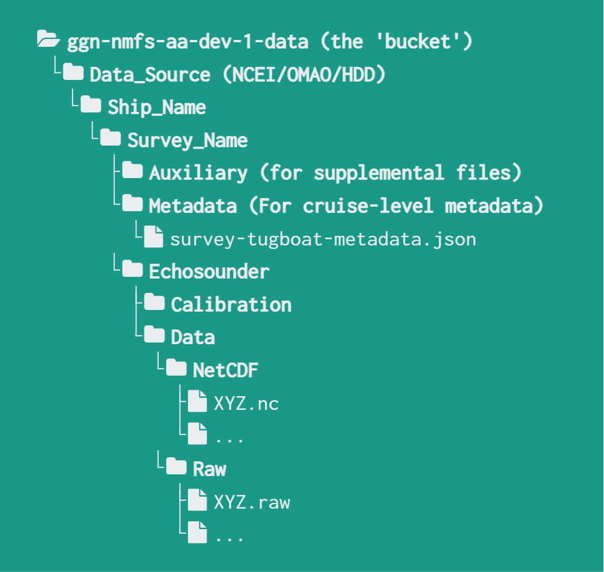
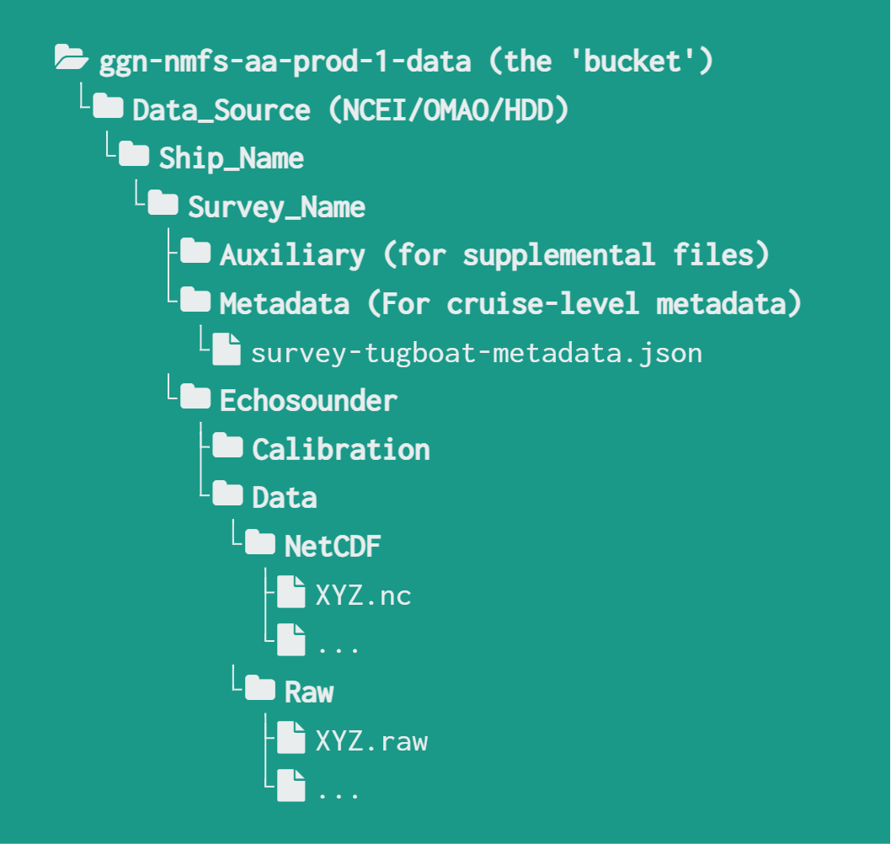
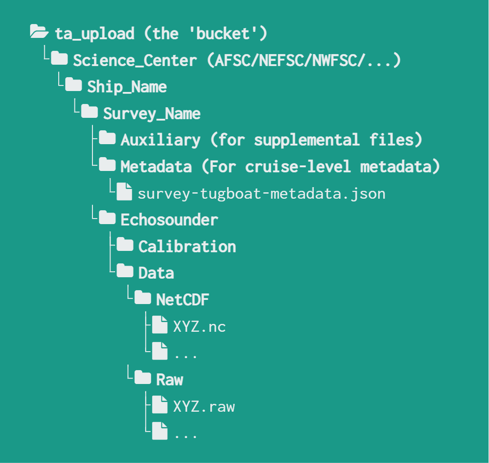
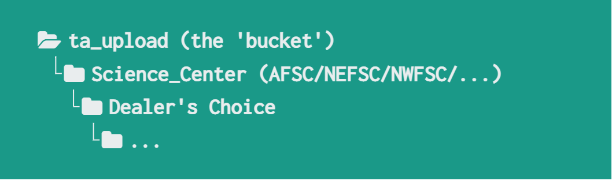
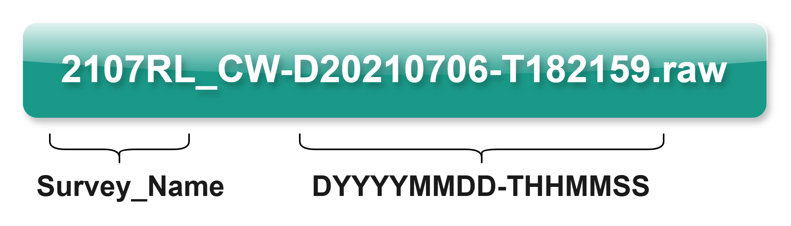

# Google Cloud Platform Overview

AALibrary serves as a data-fetching tool with many capabilities (such as Python implementation and console-based UI implementation).
This library provides also provides advanced methods for interacting with the GCP cloud storage buckets/metadata database, to allow users to fetch specific data, perform analyses, and more…

## Current Environments (aka ‘Projects’) in GCP

* ggn-nmfs-aa-dev-1:
    * Used for development purposes for AALibrary.
    * Good for testing.
    * All data exists in one storage bucket.
    * NOTE: NOT a stable environment. Data gets deleted often.
    * No workstations available.
    * Storage Bucket: ggn-nmfs-aa-dev-1-data
* ggn-nmfs-aa-prod-1:
    * Production environment.
    * Transfer Appliance files exist in separate bucket (ta_upload)
    * No workstations available.
    * Storage Buckets: ggn-nmfs-aa-prod-1-data, ta_upload (Files are stored until archival to NCEI)
* ggn-nmfs-wsent-prod-1:
    * Used for our workstations.

## Storage Bucket Layouts

### Dev Environment Layout

Below is the hierarchical layout for the development environment's storage bucket. As you can see, data is organized based on it's metadata. For example, any file relating to a specific survey will only exist within that survey's folder.

This also means that this layout has a 1:1 mapping of each file to its location in the storage bucket. This makes files easily searchable using AALibrary.

### Prod Environment Layout

The production environments storage bucket also utilizes a similar layout.

### Transfer Appliance Layout

This storage bucket (ta_upload) exists within the production environment. The layout is different here compared to the other two storage buckets. There is a hierarchical order present, but instead of viewing `/data_source/` as a storage entity, it is viewed as a Science Center entity.

There are two layouts possible here. The first refers to a similar layout that we have in the other storage buckets. This is ideally the layout we would like to reach as a strategic initiative.

The second layout is `dealer's choice`. This means that the organization of the folders within this layout is dependent on the FMC that is uploading data. Keep in mind, our goal is to upload all of the data to the cloud, so organization and file naming conventions can be corrected after the upload is done.

## File Naming Conventions

There are certain file naming conventions that we are trying to normalize here at AASI. For reference, here are the file naming conventions that our storage buckets follow:

* Files should start with with the Survey_Name
* Files should end with the DateTime string:
    * Hours should be in Military time
* Applies to Kongsberg echosounder files, other files may use other naming conventions

## Metadata Database

We have a metadata database that can hold the same Tugboat metadata for enhanced usage through the AALibrary. (e.g. searching/retrieving files from March 26th, 2024).
Coriolix Metadata is planned to be added, as more of it becomes available.
If you would like access to the metadata DB, please see the [permissions page](../getting-started/permissions.md/#gcp-bigquery-metadata-database).
