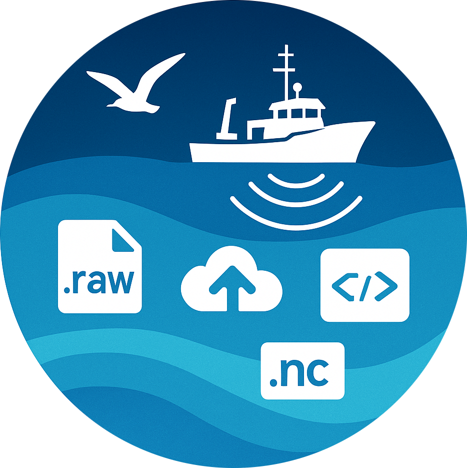

---
search:
  exclude: true
---

<!-- markdownlint-configure-file {
  "MD013": {
    "code_blocks": true,
    "tables": false
  },
  "MD033": false,
  "MD041": false,
  "MD013": false
} -->

  

  

The Active Acoustics Strategic Initiative (AASI) aims to bring more data modernization to NOAA NMFS. This library is a data management tool that provides users with an all-in-one solution to load, transform, and analyze acoustics data from all science centers across the United States. Using the library, users now have the ability to:

<ul>
  <li>Fetch data from disparate sources using a single source of retrieval, including being able to upload their personal data to the cloud.</li>
  <li>Cache repeatedly accessed data, optimizing data retrieval speeds.</li>
  <li>Transform and cache the transformed files, eliminating the need to constantly transform data before analysis.</li>
</ul>

Future plans include integration with more data sources, leading to petabytes of more data, and further integration with EchoPype. All together, the API provides users with a one-stop-shop for acoustics data.    

# Getting Started

You can check out the <a href="getting-started/installation">Getting Started Section</a> on the left for info on installation, getting permissions, and testing your install.

!!! warning "Disclaimer"
    This repository is a scientific product and is not official communication of the National Oceanic and Atmospheric Administration, or the United States Department of Commerce. All NOAA GitHub project code is provided on an ‘as is’ basis and the user assumes responsibility for its use. Any claims against the Department of Commerce or Department of Commerce bureaus stemming from the use of this GitHub project will be governed by all applicable Federal law. Any reference to specific commercial products, processes, or services by service mark, trademark, manufacturer, or otherwise, does not constitute or imply their endorsement, recommendation or favoring by the Department of Commerce. The Department of Commerce seal and logo, or the seal and logo of a DOC bureau, shall not be used in any manner to imply endorsement of any commercial product or activity by DOC or the United States Government.
