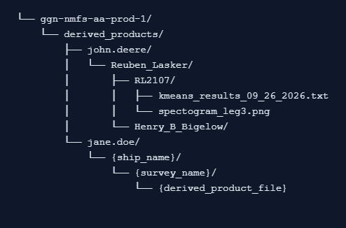

# Derived Products

AALibrary has work products related to analysis. We call these "derived products". The ultimate goal with derived products is to store them in the cloud, in order to have everything cloud-based. We also wanted to sort derived products based on users, so each user has a folder in GCS that stores their derived products. Based on these restrictions, we have achieved the following directory structure:

## Directory Structure

## Utility Functions Related To Derived Products

There are utility functions associated with the derived products in AALibrary. These can be found in the `derived.py` [file](https://github.com/nmfs-ost/AA-SI_aalibrary/blob/main/src/aalibrary/derived.py). These functions include things such as `get_all_derived_products_for_current_user()` and `upload_derived_product_to_gcp()`.

## Metadata Related To Derived Products

There is metadata associated with each derived product, and it is stored in BigQuery under the `metadata.aalibrary_derived_file_metadata` [table](https://console.cloud.google.com/bigquery?referrer=search&hl=en&invt=AbuwBQ&project=ggn-nmfs-aa-prod-1&ws=!1m6!1m5!4m3!1sggn-nmfs-aa-prod-1!2smetadata!3saalibrary_derived_file_metadata!23sRESOURCE_LIST).
